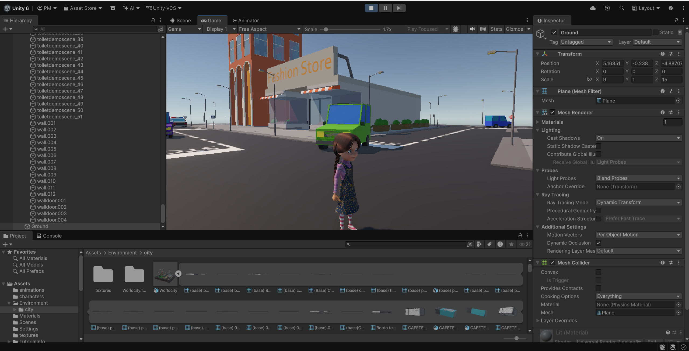

# ShinyMinds

An educational 3D game that teaches children aged 8–14 about personal safety,
communication, empathy and confidence — and a companion dashboard that lets their
parent see how they are getting on.

A child plays missions in a Unity city. Every choice they make is recorded. Those
choices become four skill scores, which their parent reads on a mobile dashboard,
alongside an assistant that can answer questions about their progress.


<!-- TODO: add screenshots/main-menu.png and screenshots/dashboard-home.png,
     then show all three side by side here. -->

---

## The three parts

| Part | Folder | Stack | What it does |
|---|---|---|---|
| **Game** | `Assets/` | Unity 6000.4.9f1, C# | The main menu and the playable city |
| **API** | `backend/` | Node 20, Express, Prisma, PostgreSQL | Accounts, progress, scoring, assistant |
| **Dashboard** | `parent-dashboard/app/` | React 19, Vite, Tailwind | What the parent sees |

Both the game and the dashboard talk only to the API. Neither talks to a database, and
neither holds a third-party API key.

```
Unity client  ──►  ShinyMinds API  ──►  PostgreSQL
                        │
Parent dashboard ──►    ├──────────►  Groq   (assistant replies)
                        │
Unity client  ─────────────────────►  Groq        (NPC dialogue)
                                      ElevenLabs  (NPC speech)
```

---

## Quick start

You need **Node 20+**, **PostgreSQL 14+** and **Unity 6000.4.9f1**.

### 1. The API

```bash
cd backend
npm install
cp .env.example .env
```

Fill in `.env`. At minimum set `DATABASE_URL` and generate the two JWT secrets:

```bash
openssl rand -base64 48
```

Then create the schema, load the mission catalogue, and start it:

```bash
createdb shinyminds
npm run prisma:migrate
npm run db:seed
npm run dev
```

The API listens on `http://localhost:4000`. Check it with:

```bash
curl http://localhost:4000/health
```

### 2. The dashboard

```bash
cd parent-dashboard/app
npm install
cp .env.example .env.local
npm run dev
```

Open `http://localhost:5173` and create a parent account.

### 3. The game

```bash
cp .env.example .env
```

Add your `GROQ_API_KEY` and `ELEVENLABS_API_KEY`, then open the project in Unity Hub and
play `Assets/Scenes/MainMenu.unity`.

---

## API keys and `.env`

**Never type a key into the Unity Inspector.**

Keys used to be public fields on `GroqDialogue` and `ElevenLabsTTS`. Unity serialises
public fields into the scene, so every developer who pasted their own key modified
`SampleScene.unity` — a 17,000-line file — and every pull produced a merge conflict.

Keys now come from `.env` files, which are git-ignored. There are three, one per part:

| File | Read by | Contains |
|---|---|---|
| `.env` | Unity | `GROQ_API_KEY`, `ELEVENLABS_API_KEY`, voice IDs, `SHINYMINDS_API_URL` |
| `backend/.env` | The API | `DATABASE_URL`, JWT secrets, `GROQ_API_KEY` for the assistant |
| `parent-dashboard/app/.env.local` | The dashboard | `VITE_API_URL` only |

Each has a committed `.env.example` listing every variable. Copy it and fill in the blanks.

Two rules worth stating plainly:

- **Nothing secret belongs in the dashboard's `.env`.** Vite inlines every `VITE_`
  variable into the JavaScript bundle, which every visitor downloads. The dashboard's
  assistant works by calling the API, which calls Groq server-side.
- Real environment variables win over `.env` in the Unity client, so CI and production
  builds can supply keys without a file on disk.

If a key is missing, you get one clear error naming the variable and the file — not a
401 from a third party.

---

## How the game is put together

### Scenes

| Scene | Build index | Contents |
|---|---|---|
| `MainMenu.unity` | 0 | A camera and one `MainMenuController` |
| `SampleScene.unity` | 1 | The playable city |

**The menu UI is built in C#, not authored into the scene.** `MainMenu.unity` is
deliberately about 260 lines. `MenuUI` and `MenuTheme` construct the canvas, panels,
buttons and fields at runtime, so the menu can be reviewed as ordinary code and two
people can change it without conflicting. `MenuTheme` holds the colours and sizes that
would otherwise be Inspector fields.

For the same reason `GameplayBootstrap` installs itself with
`[RuntimeInitializeOnLoadMethod]` and subscribes to `sceneLoaded`, rather than being
dropped into `SampleScene.unity`. Returning to the menu required no edit to that file.

### Scripts

```
Assets/Scripts/
├── Api/
│   ├── ApiClient.cs          Every call to the backend, with token refresh and retry
│   ├── ApiModels.cs          Wire models
│   └── PlayerSession.cs      Tokens in PlayerPrefs, so Continue works next launch
├── Config/
│   └── GameConfig.cs         Reads .env, or real environment variables
├── Menu/
│   ├── MainMenuController.cs Sign in → Continue / New Game / Missions / My Progress
│   ├── MenuUI.cs             Widget factory
│   ├── MenuTheme.cs          Colours, sizes, the generated rounded-rect sprite
│   ├── GameFlow.cs           Carries the chosen mission across the scene load
│   └── GameplayBootstrap.cs  Escape returns to the menu, saving progress
└── Progress/
    └── GameProgressTracker.cs  Playtime, mission attempts, individual decisions
```

Gameplay scripts (`PlayerController`, `CameraController`, `NPCInteraction`,
`GroqDialogue`, `ElevenLabsTTS`, …) remain at the top of `Assets/`.

### Recording what a child does

Missions come from the database, not from code. `GameProgressTracker` is the one place
that reports progress:

```csharp
var tracker = GameProgressTracker.Instance;

tracker.RecordDecision(
    promptCode: "cross_without_looking",
    promptText: "A ball rolls into the road. What do you do?",
    choiceText: "Stop and look both ways",
    skill:      "SAFETY",          // or COMMUNICATION, EMPATHY, CONFIDENCE
    isCorrect:  true,
    scoreDelta: 25);
```

The session, the attempt and the ownership checks are handled for you. Failures are
logged and swallowed — losing telemetry must never stop a child from playing.

---

## How scores are calculated

A child's four skill scores are derived from their decisions, never stored as a running
total. Recomputing is cheap and cannot drift when a write is retried.

The rule lives in `backend/src/domain/skills.ts`, with no database or HTTP in sight, so
it can be read and tested on its own:

```
score = 100 × (correct + 2) / (total + 4)
```

The `+2 / +4` smooths towards a neutral 50. One correct answer does not make a child
"100% safe" — a score only reaches an extreme once there is enough evidence for it. A
child who has never played sits at 50 across the board.

Overall wellbeing is the mean of the four. Anything below 78 is surfaced to the parent
as needing attention.

A snapshot of all four scores is written once per day, which is what draws the trend
chart. Days before a child first played have no snapshot at all, so the chart shows a
gap rather than a misleading drop to zero.

---

## The API

Layered so each file has one job:

```
routes/        HTTP: paths, methods, which token is required
  ↓
services/      Business rules and ownership checks
  ↓
repositories/  The only files that call Prisma
  ↓
domain/        Pure functions (scoring). No I/O.
```

`dto/` holds a zod schema per request body; `middleware/validate.ts` rejects a bad
payload with every offending field listed at once, rather than one error per attempt.

### Accounts

Two kinds, deliberately separate:

- **Parent** — email and password, signs in to the dashboard.
- **Child** — username and password, signs in to the game.

A parent gets a six-character **link code** (`Settings → Parent code`). The child types
it when creating their player, and that is what connects the two. A child can play
before linking; their data simply has no parent attached yet.

Tokens: a short-lived JWT access token, plus an opaque refresh token stored only as a
SHA-256 hash and rotated on every use. Signing out revokes it server-side.

### Endpoints

**Auth** — `/api/auth`

| Method | Path | |
|---|---|---|
| POST | `/parent/register` · `/parent/login` | Dashboard |
| POST | `/player/register` · `/player/login` | Game |
| POST | `/player/link-parent` | Attach to a parent later |
| POST | `/refresh` · `/logout` | |
| GET | `/me` | |

**Game** — `/api/game`, child token only

| Method | Path | |
|---|---|---|
| GET | `/profile` | Drives the main menu |
| GET | `/missions` | Mission select, with unlock state and best scores |
| POST | `/sessions` · `/sessions/:id/heartbeat` · `/sessions/:id/end` | Playtime |
| POST | `/missions/start` | Starts or resumes an attempt |
| POST | `/attempts/:id/decisions` | One recorded choice |
| POST | `/attempts/:id/complete` | Final marks |
| POST | `/new-game` | Clears saved progress |

**Dashboard** — `/api/dashboard`, parent token only

| Method | Path | |
|---|---|---|
| GET | `/children` | |
| GET | `/children/:id/overview` | Wellbeing, skills, this week |
| GET | `/children/:id/skills/progress?days=7` | Trend chart |
| GET | `/children/:id/activity?take=10` | Recent missions |
| GET | `/children/:id/insights` | Weekly breakdown, needs attention |
| GET/POST | `/children/:id/chat` | Assistant |

A child token cannot reach `/api/dashboard` and a parent token cannot reach `/api/game`
(403). Every `:id` is checked against the signed-in account, so one parent asking for
another parent's child gets a 404.

### The assistant

The dashboard posts a message; the backend builds a system prompt from that child's real
rows — scores, correct/total per skill, missions completed this week, playtime — and
sends it to Groq with instructions to use only those figures and to invent nothing.

The key never leaves the server. Without `GROQ_API_KEY` set, the endpoint returns a
clear 503 and the rest of the dashboard keeps working.

---

## Database

Managed with Prisma; the schema is `backend/prisma/schema.prisma`.

| Table | Holds |
|---|---|
| `parents`, `children` | Accounts |
| `refresh_tokens` | Hashed, revocable sessions |
| `missions` | The catalogue. Seeded, not hard-coded |
| `game_sessions` | One row per play session — the source of playtime |
| `mission_attempts` | One row per attempt, with marks |
| `decisions` | One row per choice — the raw material behind every score |
| `skill_snapshots` | One row per child per skill per day, for the trend chart |
| `chat_messages` | The parent's assistant transcript |

Useful commands, all from `backend/`:

```bash
npm run prisma:migrate    # create and apply a migration
npm run prisma:studio     # browse the data
npm run db:seed           # reload the mission catalogue (safe to re-run)
npm run db:reset          # drop everything and start over
```

### Adding a mission

Add an entry to `backend/prisma/seed.ts` and run `npm run db:seed`. It appears in the
game's mission list and on the dashboard with no code change. `topic` is the string
`GroqDialogue` uses to steer NPC conversation.

---

## The dashboard

```
parent-dashboard/app/src/
├── api/         client.ts (fetch, tokens, refresh), types.ts
├── auth/        AuthContext — who is signed in, which child is selected
├── hooks/       useApiData — loading / data / error in one place
├── components/  Shared UI, including the three state views
├── screens/     SignIn, Home, Insights, Assistant, Settings
└── lib/         Formatting helpers
```

There is no mock data. Every screen renders what the API returns and handles all three
states; a parent whose child has not linked yet sees their link code instead of an empty
dashboard.

---

## Controls

| Key | Action |
|---|---|
| W | Walk forward |
| Shift + W | Run |
| S | Walk backward |
| A / D | Turn |
| Space | Jump |
| Mouse | Rotate camera |
| E | Advance dialogue |
| F | Leave dialogue |
| Esc | Return to the main menu |

---

## Working on this project

- Read `AGENTS.md` before making architectural changes.
- Do not add UI to `SampleScene.unity` if it can be built from code. That file is the
  main source of merge conflicts on this project.
- Large binaries (`.fbx`, `.blend`, `.wav`, `.mp3`, `.psd`) belong in Git LFS.
  `.cs`, `.unity`, `.prefab`, `.asset` and `.meta` must not.
- Never commit a `.env`. Add new variables to the matching `.env.example`.

---

## Troubleshooting

**"Cannot reach the ShinyMinds server"** — the API is not running, or
`SHINYMINDS_API_URL` / `VITE_API_URL` points somewhere else. Check
`curl http://localhost:4000/health`.

**CORS errors in the browser** — add the dashboard's origin to `CORS_ORIGINS` in
`backend/.env` and restart. The Unity client is unaffected; it is not a browser.

**"Missing 'GROQ_API_KEY'" in the Unity console** — copy `.env.example` to `.env` in the
repository root and fill it in. There is nothing to set in the Inspector.

**The assistant returns 503** — `GROQ_API_KEY` is not set in `backend/.env`.

**`Invalid environment configuration` when starting the API** — the message lists the
variables that are missing or too short. JWT secrets must be at least 32 characters.
